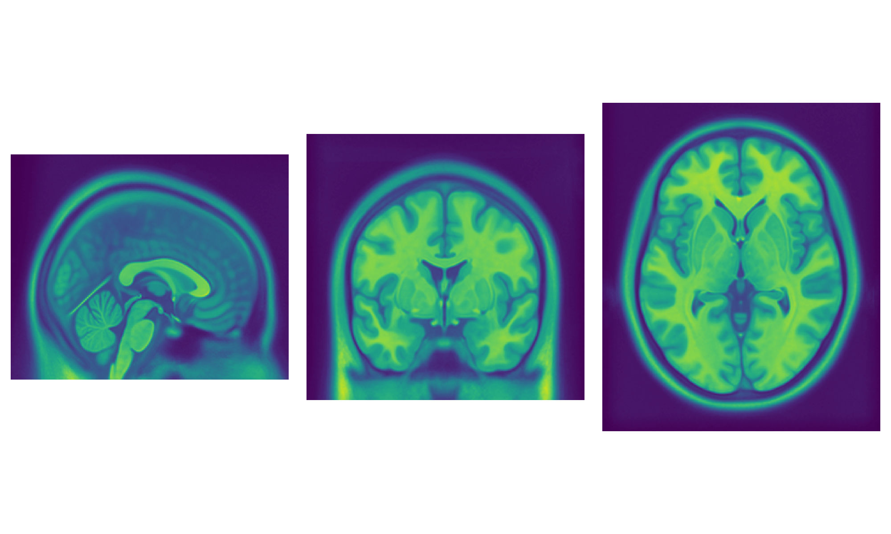
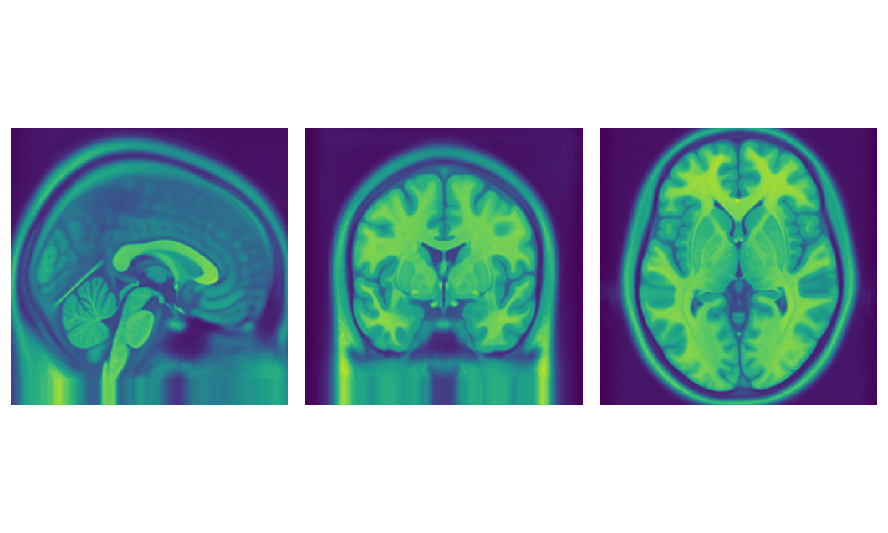
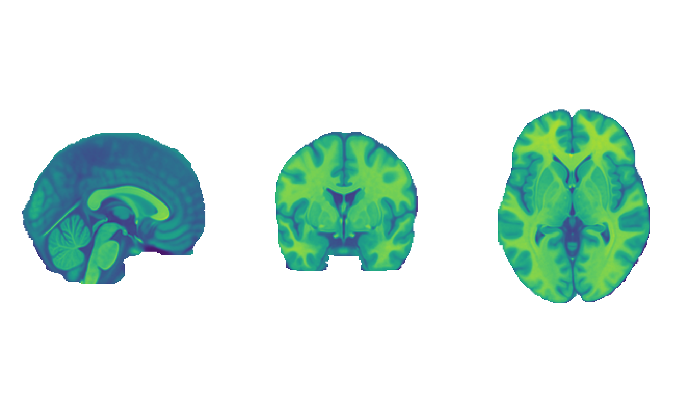
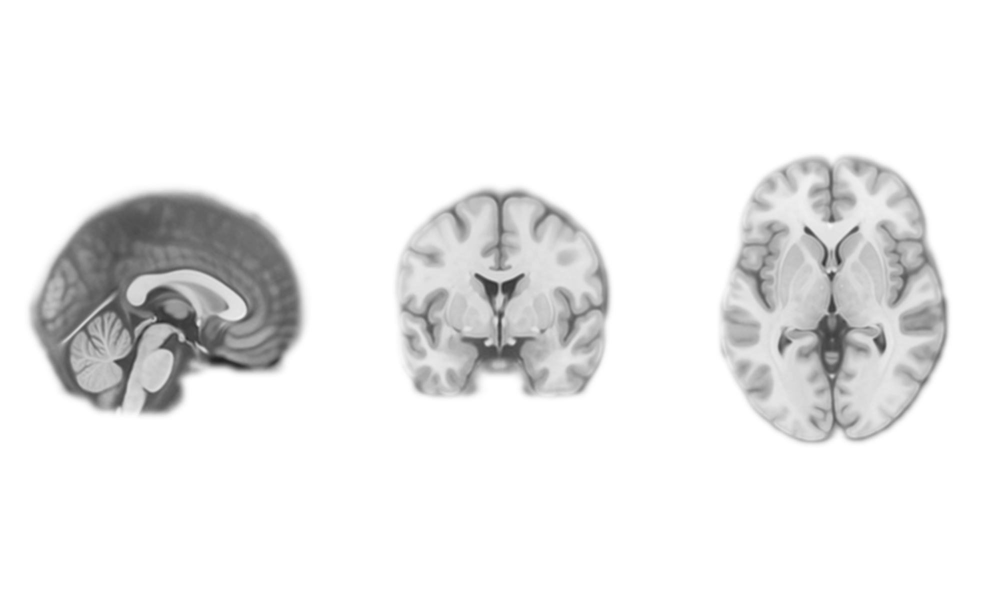
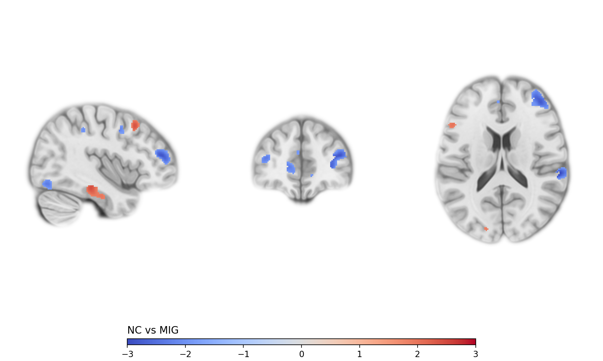

# Tutorial 1 - Simple XYZ layout

[Back to all examples](../README.md)

In this example we will create a simple visualization of the data
of [this open access paper by Chen et al. (2018)](http://doi.org/10.1186/s10194-018-0834-6) (
randomly selected) as [its statistical maps are publicly availabe](https://neurovault.org/collections/3198/).

### Step 1: Background layer

First we need a structural (T1) image to use as a backround.

As our data is in MNI space, a MNI standard template is a natural choice.
These are available from many sources such
as [from the McConnell Brain Imaging Centre](https://www.bic.mni.mcgill.ca/ServicesAtlases/ICBM152NLin2009).
First we will use:

- [A high (0.5 mm) resolution T1 image](http://www.bic.mni.mcgill.ca/~vfonov/icbm/2009/mni_icbm152_nlin_asym_09b_nifti.zip): `/mni_icbm152_t1_tal_nlin_asym_09b_hires.nii`

To get started

```Python
import mrirage as mir

PATH_MNI_T1 = 'data/mni_icbm152_t1_tal_nlin_asym_09b_hires.nii'

comp = mir.quick_xyz(
    layers=[
        mir.LayerVoxel(
            data=PATH_MNI_T1
        )
    ]
)

comp.render_show()
```



To understand what this code did let's clarify some basic concepts of `mrirage`:

> A _Composition_ is the datastructure `mrirage` uses that contains all the necessary information to render a Figure. It
> contains both _Layers_ and _Views_.
> The function `.quick_xyz()` takes care of creating both the _Composition_ and fills it with _Views_ so we will skip
> the
> details of those concepts in this tutorial for now.
>
> _Layers_ are similar to what they are in image manipulation programs (_e.g._ Gimp, Adobe Photoshop).

Now lets see what we can improve about the background layer before we start adding other layers.

Note that the three images in our figure do all have different aspect ratios.
By default `mrirage` will use all information that is available and infer the output dimensions from there.
We can specify a equilateral cube as `bounds` to fix this. Fortunately there is a helper function that returns one for
the MNI space so we don't have to look up the MNI dimensions of a brain:

```Python
import mrirage as mir

PATH_MNI_T1 = 'data/mni_icbm152_t1_tal_nlin_asym_09b_hires.nii'

comp = mir.quick_xyz(
    layers=[
        mir.LayerVoxel(
            data=PATH_MNI_T1
        )
    ],
    bounds=mir.bounds_mni_cube()
)

comp.render_show()
```



> Note that by setting the bounds `mrirage` both crops and extends the image by repeating edge voxels.

Now lets use the brain mask which we can also download
from [from the McConnell Brain Imaging Centre](https://www.bic.mni.mcgill.ca/ServicesAtlases/ICBM152NLin2009) to cut
away the rest of the skull and create a borderless background image:

- [1 mm head mask](http://www.bic.mni.mcgill.ca/~vfonov/icbm/2009/mni_icbm152_nlin_asym_09a_nifti.zip): `/icbm_avg_152_t1_tal_lin_mask.nii`

```Python
import mrirage as mir

PATH_MNI_T1 = 'data/mni_icbm152_t1_tal_nlin_asym_09b_hires.nii'
PATH_MNI_MASK = 'data/icbm_avg_152_t1_tal_lin_mask.nii'

comp = mir.quick_xyz(
    layers=[
        mir.LayerVoxel(
            data=PATH_MNI_T1,
            alpha_map=mir.get_nifti_cube(PATH_MNI_MASK).normalize()
        )
    ],
    bounds=mir.bounds_mni_cube()
)

comp.render_show()
```



Now to make this look a bit nicer lets apply some gaussian smoothing the alpha mask, use a gray color scale and set
the screen interpolation to bicubic:

```Python
import mrirage as mir

PATH_MNI_T1 = 'data/mni_icbm152_t1_tal_nlin_asym_09b_hires.nii'
PATH_MNI_MASK = 'data/icbm_avg_152_t1_tal_lin_mask.nii'

comp = mir.quick_xyz(
    layers=[
        mir.LayerVoxel(
            data=PATH_MNI_T1,
            alpha_map=mir.get_nifti_cube(PATH_MNI_MASK).apply_gaussian(sigma=2).normalize(),
            color_scale=mir.ColorScaleFromName('Greys_r'),
            interp_screen='bicubic'
        )
    ],
    bounds=mir.bounds_mni_cube()
)

comp.render_show()
```



This is already starting to look promising. Now let's proceed by adding the statistical maps.

### Step 2: Statistical maps

We will use the following statistical map file from [Chen et al. (2018)](http://doi.org/10.1186/s10194-018-0834-6):

- [Q1 NC vs MIG](https://neurovault.org/images/57523/) `/Q1_NC_vs_MIG.nii.gz`

At this point adding it as a voxel layer should be straight forward:

```Python
import mrirage as mir

PATH_MNI_T1 = 'data/mni_icbm152_t1_tal_nlin_asym_09b_hires.nii'
PATH_MNI_MASK = 'data/icbm_avg_152_t1_tal_lin_mask.nii'
PATH_STAT_MAP = 'data/Q1_NC_vs_MIG.nii.gz'

comp = mir.quick_xyz(
    layers=[
        mir.LayerVoxel(
            data=PATH_MNI_T1,
            alpha_map=mir.get_nifti_cube(PATH_MNI_MASK).apply_gaussian(sigma=2).normalize(),
            color_scale=mir.ColorScaleFromName('Greys_r'),
            interp_screen='bicubic'
        ),
        mir.LayerVoxel(
            data=PATH_STAT_MAP,
            color_scale=mir.ColorScaleFromName('coolwarm', vmin=-3, vmax=3),
            alpha_map=lambda image: abs(image) > 1.8,
            legend=True,
            legend_label='NC vs MIG'
        )
    ],
    bounds=mir.bounds_mni_cube(),
    origin=(41, 47, 17)
)

comp.render_show()
```



A lot of things happened in the last code chunk:

- `color_scale=mir.ColorScaleFromName('coolwarm', vmin=-3, vmax=3)` We use a blue/red color scale with fixed limits for
  the statistical map.
- `alpha_map=lambda image: abs(image) > 1.8` (lambda) functions can be used to define alpha maps in relation to the
  original image. Here we use this to 'threshold' values > 1.8 (and < -1.8).
- `origin=(41, 47, 17)` sets the point in which the image is sliced (this is an arbitrary point for demonstration
  purposes).
- `legend=True, legend_label='NC vs MIG'` specifies that a legend entry should be generated for this layer (color bar at
  the bottom).

Now let's add some annotation layers to finish:

```Python
import mrirage as mir

PATH_MNI_T1 = 'data/mni_icbm152_t1_tal_nlin_asym_09b_hires.nii'
PATH_MNI_MASK = 'data/icbm_avg_152_t1_tal_lin_mask.nii'
PATH_STAT_MAP = 'data/Q1_NC_vs_MIG.nii.gz'

comp = mir.quick_xyz(
    layers=[
        mir.LayerVoxel(
            data=PATH_MNI_T1,
            alpha_map=mir.get_nifti_cube(PATH_MNI_MASK).apply_gaussian(sigma=2).normalize(),
            color_scale=mir.ColorScaleFromName('Greys_r'),
            interp_screen='bicubic',
            legend=True,
            legend_label='Structure'
        ),
        mir.LayerVoxel(
            data=PATH_STAT_MAP,
            color_scale=mir.ColorScaleFromName('coolwarm', vmin=-3, vmax=3),
            alpha_map=lambda image: abs(image) > 1.8,
            legend=True,
            legend_label='NC vs MIG'
        ),
        mir.LayerCrossOrigin(
            style=mir.Style(color='black', alpha=0.6),
            padding_inner=4,
            legend=True
        ),
        mir.LayerCoordinate()
    ],
    bounds=mir.bounds_mni_cube(),
    origin=(41, 47, 17)
)

comp.render_show()
```


If you made it until this part of the tutorial, you most likely understand how the last code chunk worked.
Nonetheless here is a short description of the newly introduced layers:

- `LayerCrossOrigin` this annotation layer draws cross lines through the origin position so layer positions can be
  easily cross-referenced.
- `LayerCoordinate` this layer adds the slice depth in view direction to the individual views (_i.e._ upper left
  corners).
- In this step we also enabled more layer legend entries to demonstrate its flexibility.
- A `Style` object is created to style the `LayerCrossOrigin`. Note that you can also add a `Style` to the _Composition_
  to define a base style for all layers which can then be overloaded by layer style properties.

### Full code example

The full code for this tutorial [can be found here](./main.py).

### What's next?

The next example will show how more complex graphics can be created by manually setting up _Composition_ and _Views_.

TODO

After that we will have a look at expanding `mrirage` by adding custom _Layer_ components and _Composition_ layouts.

TODO

[Back to all examples](../README.md)